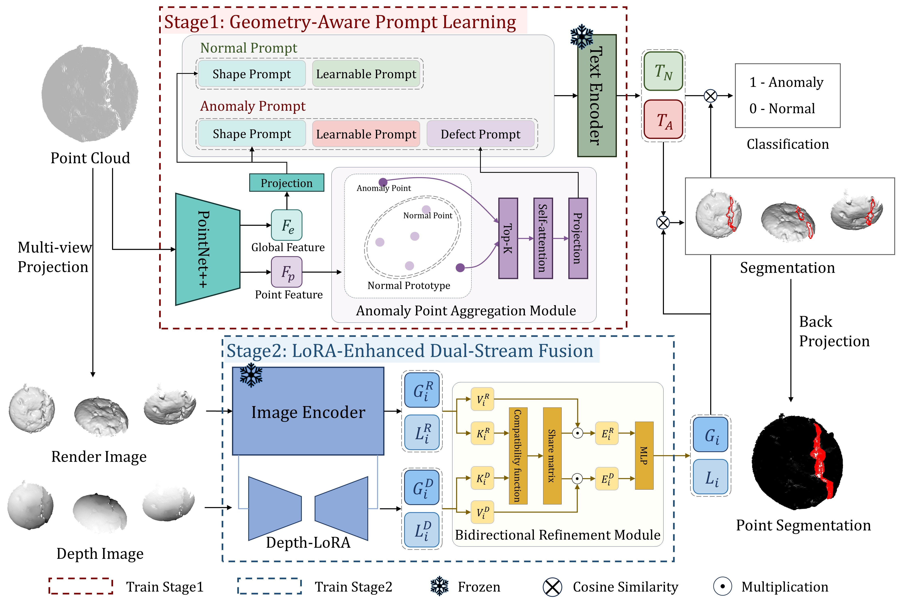

# GD-CLIP: Zero-shot 3D Anomaly Detection by Geometry-Aware Prompt and Dual-Stream Fusion

## Introduction
Zero-shot 3D Anomaly Detection (ZS3DAD) is an emerging task that aims to detect anomalies in a target dataset without any target training data, which is particularly important in scenarios constrained by sample scarcity and data privacy concerns. Most existing methods leverage CLIP by projecting 3D point clouds into multi-view 2D images and then back-projecting the CLIP-based results onto the 3D space. However, this 3D-to-2D projection process inevitably results in the loss of critical geometric details, limiting the model's awareness of 3D geometric structures. Furthermore, existing methods typically rely on a single 2D representation, resulting in incomplete utilization of the available visual information. To address these limitations, we propose the Geometry-Aware Prompt and Dual-Stream Fusion (GD-CLIP) framework, which enables the model to identify geometric anomalies through a two-stage learning process. In the first stage, we use a 3D feature extractor to dynamically inject the global shape context and local defect information, identified by a designed Anomaly Point Aggregation Module (APAM), into text prompts. Such prompts provide direct geometric priors for the model to identify anomalies in 2D images. In the second stage, we introduce a LoRA-enhanced Dual-stream Fusion architecture that processes rendered and depth images in parallel. A Bidirectional Refinement Module (BRM) subsequently fuses the features of both streams, capitalizing on their complementary strengths. Comprehensive experimental results on four large-scale public datasets show that GD-CLIP achieves state-of-the-art performance in both object-level and point-level metrics, validating the effectiveness of our proposed method.

## Overview


### Prepare Dataset
Download the original dataset at 
[Mvtec3D-AD](https://www.mvtec.com/company/research/datasets/mvtec-3d-ad), [Eyecandies](https://eyecan-ai.github.io/eyecandies/), 
[Real3D-AD](https://github.com/M-3LAB/Real3D-AD), [Anomaly-ShapeNet](https://github.com/Chopper-233/Anomaly-ShapeNet)

The rendering and depth images of Anomaly-ShapeNet are avalible at [this](

The rendering images of MVTecAD-3D, Eyecandies, and Real3D-AD are avalible at [this](https://github.com/zqhang/PointAD), 

You can also genarate rendering and depth images through ./data_preprocess and [this](https://github.com/zqhang/PointAD/tree/master/multi_view).

### Generate the dataset JSON
Generate dataset json for training:

```bash
bash generate_dataset_json/generate_training_datasets_class_specific.sh
```

Generate dataset json for testing:

```bash
bash generate_dataset_json/generate_training_datasets_whole.sh
```

### Download Pretrained Weight
 Download the CLIP weights pretrained by OpenAI [[ViT-L-14-336.pt](https://openaipublic.azureedge.net/clip/models/3035c92b350959924f9f00213499208652fc7ea050643e8b385c2dac08641f02/ViT-L-14-336px.pt)].

 Download the PointNet++ initial weights at [here](https://github.com/yanx27/Pointnet_Pointnet2_pytorch/blob/master/log/sem_seg/pointnet2_sem_seg/checkpoints/best_model.pth) .
 
 Put them to ./pretrained_weights/


### Create Environments
```bash
conda create -n gdclip python=3.9
conda activate gdclip
pip install -r requirements.txt
```

### Train and Test
The two-stage training and test are included in this script: 
```bash
bash train2.sh
```

* We thank for the code repository: [PointAD](https://github.com/zqhang/PointAD)
